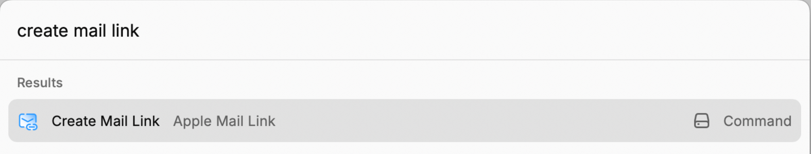

# Apple Mail Link

[Rycast](https://www.raycast.com) extension to create a link of the selected email in Apple Mail and copy it to the clipboard.

## Usage

This is useful for referencing emails in other applications. For example, you can paste the link in a task manager to reference the email in the task.

## Credits

- [John Voorhees](https://www.macstories.net/stories/generating-markdown-links-to-mail-messages-with-shortcuts-and-applescript/)
- [John Gruber](https://daringfireball.net/2007/12/message_urls_leopard_mail)
- [@sepulchra](https://github.com/sepulchra/alfred-mail-link)
